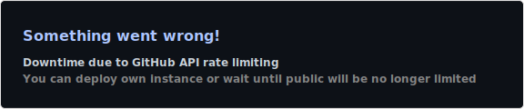

<!--
  ╔═══════════════════════════════════════════════════╗
  ║  sparsh-karna  ·  computational developer         ║
  ║  github.com/sparsh-karna                          ║
  ╚═══════════════════════════════════════════════════╝
-->

 

  

*Third-year CS undergrad building high-performance systems at the intersection of **AI**, **computational chemistry**, and **scientific computing**.*

 

<!-- ═══════════════════════════════════════════════════════ -->

## `// ACTIVE_PROJECTS`

<table>
<tr>
<td width="60%" valign="top">

### 🔬 Hybrid Solvers @ QC-Devs

Contributing to [NICE.jl](https://github.com/theochem/NICE.jl) — enhancing chemical equilibrium analysis with **hybrid kinetic Monte Carlo solvers** in Julia. Combining `NonlinearSolve.jl` with stochastic simulation algorithms for high-performance reaction network modeling.

</td>
<td width="40%" valign="top">

### 📊 AnalyzeX

ML classifier predicting **research paper publishability** using XGBoost. Extracts 16 features — readability metrics, structural analysis, citation patterns — across 818 academic papers from NeurIPS and other venues.

<h2 align="center">94.4%</h2>

TEST SET ACCURACY

</td>
</tr>
<tr>
<td width="60%" valign="top">

### 🌐 Bodhini

AI-powered **multilingual chatbot** breaking communication barriers with RAG-based retrieval, voice-to-text/text-to-speech, and real-time contextual conversations. Built with Flask, MongoDB, Gemini 1.5 Flash, Chroma vector DB, and Sentence Transformers.

| Capability | Detail |
|:--|:--|
| NLU | Contextual multi-turn conversations |
| Speech | Voice-to-text & text-to-speech |
| Search | Hybrid semantic RAG retrieval |
| AI | Gemini 1.5 Flash + Sentence Transformers |

</td>
<td width="40%" valign="top">

### 🔮 MandelbrotSet

Static (36K×36K px) & interactive GPU-accelerated Mandelbrot fractal renderer using **OpenGL shaders**. Real-time zoom at 60 FPS.

Python + GLSL · 1000 iterations · GPU-accelerated

</td>
</tr>
</table>

 

<!-- ═══════════════════════════════════════════════════════ -->

## `// TECH_STACK`

| Domain | Technologies |
|:--|:--|
| **Languages** | Python · Julia · C++ · JavaScript · TypeScript · SQL |
| **AI / ML** | XGBoost · Sentence Transformers · Google Generative AI (Gemini) |
| **Web** | Flask · FastAPI · React · MongoDB · Chroma |
| **Scientific** | NonlinearSolve.jl · NumPy · OpenGL / GLSL |
| **Tools** | Git · Linux · Docker |

 

 

<!-- ═══════════════════════════════════════════════════════ -->

## `// SYSTEM_TELEMETRY`

<table>
<tr>
<td>

</td>
<td>

</td>
</tr>
</table>

 

 

 

<!-- ═══════════════════════════════════════════════════════ -->

## `// REPOSITORIES`

 

<!-- ═══════════════════════════════════════════════════════ -->

## `// CONNECT`

&nbsp;

&nbsp;

  

  

© 2025 sparsh-karna · built with curiosity

